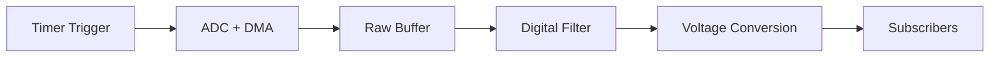

# ADC Acquisition Service

## Overview

The ADC Acquisition Service provides high-performance, timer-triggered ADC sampling with DMA transfer, digital filtering, and a publish-subscribe mechanism for distributing ADC data to multiple consumers. The service is fully configured via Kconfig and devicetree and operates in a dedicated thread.

## Features

- **Timer-Triggered Acquisition**: Configurable sampling rate using hardware timer triggers
- **DMA-Based Transfer**: Efficient zero-copy data acquisition using Direct Memory Access
- **3rd-Order Cascaded RC Filtering**: Digital low-pass filtering with configurable cutoff frequency
- **Publish-Subscribe Pattern**: Memory pool-based asynchronous data distribution to multiple subscribers
- **VREFINT Calibration**: Automatic VDD voltage measurement using internal voltage reference
- **Thread-Safe**: Dedicated service thread with synchronization primitives
- **Devicetree-Driven**: ADC channels and trigger timer configured via devicetree
- **Shell Commands**: Runtime debugging and inspection via Zephyr shell

## Architecture

### Thread Model

The service runs a dedicated thread that loops at the notification rate interval:
1. Polls the control queue with a `notificationRate` timeout (handles stop/suspend requests)
2. Processes filtered ADC data and calculates voltage values using VREFINT calibration
3. Notifies active subscribers by allocating a memory pool block and calling each callback

ADC sampling happens independently and asynchronously: a hardware timer fires at the sampling
rate, triggers an async ADC conversion via DMA, and the completion callback pushes raw samples
into the digital filter buffers. The service thread reads the filter output on each notification
interval.

### Data Flow



### Memory Pool Pattern

The service uses CMSIS-RTOS v2 memory pools to pass ADC data to subscribers:
- Pool is created with `2 × maxSubCount` blocks
- Each block contains: `sizeof(SrvMsgPayload_t) + (channelCount × sizeof(float))`
- Data includes the embedded pool ID (`poolId`) for proper cleanup
- Subscribers **must** free memory after processing: `osMemoryPoolFree(data->poolId, data)`

## Configuration

### Kconfig Options

Enable the service in `prj.conf`:
```kconfig
CONFIG_ENYA_ADC_ACQUISITION=y
CONFIG_ENYA_ADC_ACQUISITION_LOG_LEVEL=3
CONFIG_ENYA_ADC_ACQUISITION_STACK_SIZE=1024
CONFIG_ENYA_ADC_ACQUISITION_SAMPLING_RATE_US=500
CONFIG_ENYA_ADC_ACQUISITION_FILTER_TAU=31
CONFIG_ENYA_ADC_ACQUISITION_MAX_SUB_COUNT=4
CONFIG_ENYA_ADC_ACQUISITION_NOTIFICATION_RATE_MS=10
```

Required dependencies:
```kconfig
# CMSIS-RTOS v2 for memory pools
CONFIG_CMSIS_RTOS_V2=y
CONFIG_CMSIS_V2_MEM_SLAB_MAX_DYNAMIC_SIZE=1024

# Heap for dynamic allocation
CONFIG_HEAP_MEM_POOL_SIZE=8192
```

### Devicetree Configuration

Define ADC channels in the `zephyr,user` node and create an alias for the trigger timer:

```dts
/ {
  aliases {
    adc-trigger = &adc_trigger_counter;
  };

  zephyr,user {
    io-channels = <&adc1 0>, <&adc1 1>, <&adc1 4>, <&adc1 13>;
    vref-channel-index = <3>;  /* Index of VREFINT channel */
  };
};

&timers6 {
  status = "okay";
  st,prescaler = <31999>;  /* 64MHz / 32000 = 2kHz timer clock */

  adc_trigger_counter: counter {
    status = "okay";
  };
};

&adc1 {
  status = "okay";
  pinctrl-0 = <&adc1_in0_pa0>, <&adc1_in1_pa1>, <&adc1_in4_pa4>;
  pinctrl-names = "default";

  dmas = <&dmamux1 1 5 (STM32_DMA_PERIPH_TO_MEMORY | STM32_DMA_MEM_INC |
                         STM32_DMA_PERIPH_16BITS | STM32_DMA_MEM_16BITS)>;
  dma-names = "adc";

  channel0: channel@0 {
    reg = <0>;
    zephyr,gain = "ADC_GAIN_1";
    zephyr,reference = "ADC_REF_INTERNAL";
    zephyr,acquisition-time = <ADC_ACQ_TIME(ADC_ACQ_TIME_TICKS, 40)>;
    zephyr,oversampling = <4>;
    zephyr,resolution = <12>;
  };
  /* Additional channels... */
};
```

## Digital Filtering

The service implements a 3rd-order cascaded RC low-pass filter using integer mathematics for
efficiency.

### Filter Equation

Each stage uses: `y[n] = y[n-1] + α × (x[n] - y[n-1])`
where `α = tau / 512` (FILTER_PRESCALE = 9)

### Calculating Filter Tau

To calculate the tau value for a desired 3rd-order cutoff frequency (`fc_3rd`):

1. Calculate the required 1st-order cutoff:
   ```
   fc_1st = fc_3rd / 0.5098
   ```

2. Calculate alpha:
   ```
   α = 1 - exp(-2π × fc_1st / fs)
   ```
   where `fs` is the sampling frequency (1/samplingRate)

3. Calculate tau:
   ```
   tau = α × 512
   ```

4. Round to nearest integer (valid range: 1 to 511)

### Example Calculation

For `fs = 2000 Hz` (samplingRate = 500 μs) and desired `fc_3rd = 10 Hz`:
```
fc_1st = 10 / 0.5098 ≈ 19.6 Hz
α = 1 - exp(-2π × 19.6 / 2000) ≈ 0.0614
tau = 0.0614 × 512 ≈ 31
```

**Note**: Each RC stage has cutoff `fc_1st`, but cascading three stages results in:
`fc_3rd = fc_1st × 0.5098`

## API Usage

### Initialization

The service is fully configured via Kconfig — no runtime parameters are required:

```c
#include "adcAcquisition.h"

int err = adcAcqInit();
if (err < 0) {
  LOG_ERR("ADC init failed: %d", err);
  return err;
}
```

### Subscribing to ADC Data

The callback receives a `SrvMsgPayload_t` containing voltage values for all channels as floats.
The subscriber **must** free the payload back to the pool before returning.

```c
int adcCallback(SrvMsgPayload_t *data)
{
  size_t chanCount = data->dataLen / sizeof(float);
  float *voltages = (float *)data->data;

  /* Process voltage values */
  for (size_t i = 0; i < chanCount; i++) {
    LOG_INF("ch%d: %.3f V", i, (double)voltages[i]);
  }

  /* CRITICAL: always free memory back to pool */
  osMemoryPoolFree(data->poolId, data);

  return 0;
}

/* Subscribe to ADC updates */
err = adcAcqSubscribe(adcCallback);
if (err < 0) {
  LOG_ERR("Subscribe failed: %d", err);
}
```

### Managing Subscriptions

```c
/* Pause a subscription (stop receiving callbacks) */
err = adcAcqPauseSubscription(adcCallback);

/* Resume a paused subscription */
err = adcAcqUnpauseSubscription(adcCallback);

/* Unsubscribe completely */
err = adcAcqUnsubscribe(adcCallback);
```

## Shell Commands

The service provides shell commands for runtime debugging:

```bash
# Get the number of configured ADC channels
uart:~$ adc_acq get_chan_count
SUCCESS: channel count: 4

# Get raw ADC value for channel 0
uart:~$ adc_acq get_raw 0
SUCCESS: channel 0 raw value: 8192

# Get voltage value for channel 0
uart:~$ adc_acq get_volt 0
SUCCESS: channel 0 volt value: 1.650 V
```

## Memory Pool Sizing

The service automatically calculates memory pool size based on configuration:

- **Block Size**: `sizeof(SrvMsgPayload_t) + (channelCount × sizeof(float))`
- **Block Count**: `2 × CONFIG_ENYA_ADC_ACQUISITION_MAX_SUB_COUNT`

Ensure `CONFIG_CMSIS_V2_MEM_SLAB_MAX_DYNAMIC_SIZE` is larger than the total pool memory
(`blockSize × blockCount`).

## Best Practices

1. **Always Free Memory**: Subscribers must call `osMemoryPoolFree(data->poolId, data)` after processing
2. **Keep Callbacks Fast**: Callbacks run in the service thread context; avoid blocking operations
3. **Use Message Queues**: For heavy processing, copy data to a message queue and free immediately:
   ```c
   int callback(SrvMsgPayload_t *data) {
     float voltages[MY_CHAN_COUNT];
     memcpy(voltages, data->data, data->dataLen);
     osMemoryPoolFree(data->poolId, data);
     return k_msgq_put(&myQueue, voltages, K_NO_WAIT);
   }
   ```
4. **Configure Adequate Heap**: Ensure heap size accommodates memory pool requirements
5. **Match Sampling and Notification Rates**: Set notification rate as a multiple of sampling period

## Troubleshooting

### Pool Allocation Failures

**Symptom**: `ERROR: pool allocation failed for subscription X`

**Causes**:
- All pool blocks in use (subscribers not freeing memory)
- Callbacks taking too long (blocking pool returns)

**Solutions**:
- Verify all callbacks call `osMemoryPoolFree(data->poolId, data)`
- Increase `CONFIG_ENYA_ADC_ACQUISITION_MAX_SUB_COUNT` (increases pool size)
- Increase `CONFIG_ENYA_ADC_ACQUISITION_NOTIFICATION_RATE_MS` (slower callback frequency)

### Memory Pool Creation Failure

**Symptom**: `ERROR -12: unable to create subscription data pool`

**Causes**:
- `CONFIG_HEAP_MEM_POOL_SIZE` too small
- `CONFIG_CMSIS_V2_MEM_SLAB_MAX_DYNAMIC_SIZE` too small

**Solutions**:
- Increase heap: `CONFIG_HEAP_MEM_POOL_SIZE=8192`
- Increase CMSIS limit: `CONFIG_CMSIS_V2_MEM_SLAB_MAX_DYNAMIC_SIZE=1024`

## Implementation Notes

- Service uses VREFINT (internal voltage reference) for VDD measurement and voltage calibration
- Timer trigger prevents ADC overruns with a busy flag
- Digital filter state is maintained across conversions for each channel
- Subscription array uses dynamic allocation with Kconfig-defined limits
- Thread priority is set via `CONFIG_ENYA_ADC_ACQUISITION_THREAD_PRIORITY`
