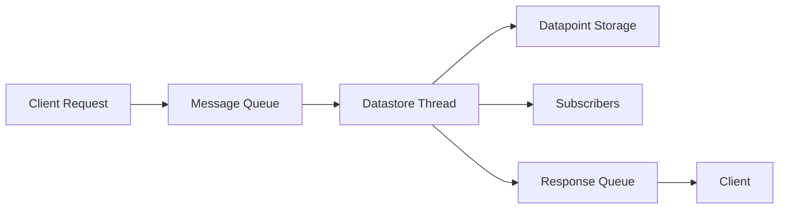
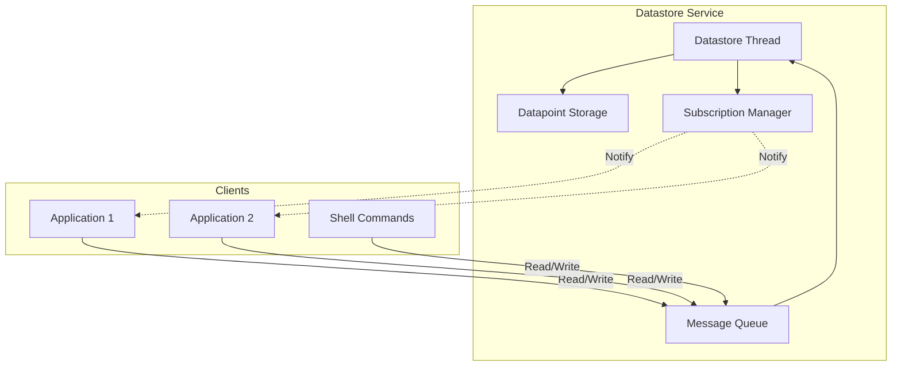

# Embedded Datastore


Electronya embedded datastore for Zephyr RTOS based firmware.

## Overview

The Embedded Datastore provides a centralized, thread-safe data management service for embedded applications. It supports multiple datapoint types with publish-subscribe pattern for data distribution, optional NVM persistence, and shell command interface for runtime debugging.

This service is designed to be integrated into target application projects as a git subtree.

## Features

- **Multiple Datapoint Types**: Binary, Button, Float, Integer, Multi-State, and Unsigned Integer
- **Publish-Subscribe Pattern**: Asynchronous data distribution to multiple subscribers
- **NVM Persistence**: Optional non-volatile memory storage for datapoints
- **Thread-Safe**: Dedicated service thread with message queue synchronization
- **Shell Commands**: Runtime inspection and modification via Zephyr shell
- **X-Macro Configuration**: Compile-time datapoint definition using X-macros
- **Git Subtree Integration**: Easy integration into target projects

## Supported Datapoint Types

| Type | Description | Value Type |
|------|-------------|------------|
| Binary | Boolean/digital values | `bool` |
| Button | Button state (unpressed, short press, long press) | `ButtonState_t` |
| Float | Floating point values | `float` |
| Integer | Signed 32-bit integers | `int32_t` |
| Multi-State | Enumerated states | `uint32_t` |
| Unsigned Integer | Unsigned 32-bit integers | `uint32_t` |

## Integration

### Adding as Git Subtree

Add the embedded-datastore to your project:

```bash
cd /path/to/your/project
git subtree add --prefix embedded-datastore https://github.com/electronya/embedded-datastore.git main --squash
```

Update the subtree:

```bash
git subtree pull --prefix embedded-datastore https://github.com/electronya/embedded-datastore.git main --squash
```

### CMakeLists.txt Integration

Add to your project's `CMakeLists.txt`:

```cmake
add_subdirectory(embedded-datastore)
target_link_libraries(app PRIVATE enya_datastore)
```

## Configuration

### Kconfig Options

Enable the datastore in `prj.conf`:

```kconfig
CONFIG_ENYA_DATASTORE=y
CONFIG_ENYA_DATASTORE_LOG_LEVEL=3

# Required dependencies
CONFIG_CMSIS_RTOS_V2=y
```

Optional configuration:

```kconfig
# Customize default values
CONFIG_FIRST_FLOAT_DEFAULT_VAL=123
CONFIG_SECOND_INT_DEFAULT_VAL=-12
```

### Defining Datapoints

Applications must provide a `datastoreMeta.h` file in their `src/` directory to define their datapoints using X-macros.

Create `src/datastoreMeta.h` in your application with the following template:

```c
/**
 * @file      datastoreMeta.h
 * @brief     Application Datastore Metadata
 *
 *            Application-specific datapoint definitions for datastore service.
 */

#ifndef DATASTORE_META_H
#define DATASTORE_META_H

#include "datastoreTypes.h"

/* ============================================================================
 * Multi-State Datapoint State Definitions
 * ============================================================================
 * Define enumerations for each multi-state datapoint used in your application.
 * Each multi-state datapoint should have its own enum.
 */

/**
 * @brief   Example multi-state datapoint states.
 */
typedef enum
{
  MY_STATE_1 = 0,
  MY_STATE_2,
  MY_STATE_3,
  MY_STATE_COUNT
} MyMultiStates_t;

/* ============================================================================
 * Datapoint X-Macro Definitions
 * ============================================================================
 * Define your application's datapoints using X-macros.
 * Format: X(datapoint_id, flags, default_value)
 *
 * Flags:
 *   - DATAPOINT_NO_FLAG_MASK: Datapoint is not persisted to NVM
 *   - DATAPOINT_FLAG_NVM_MASK: Datapoint is persisted to NVM
 *
 * Default values:
 *   - Binary: true or false
 *   - Button: 0 (BUTTON_UNPRESSED)
 *   - Float: floating point value (e.g., 1.23f)
 *   - Integer: signed integer value (e.g., -10)
 *   - Multi-State: enum value from your state definitions
 *   - Unsigned Integer: unsigned integer value (e.g., 100)
 */

/**
 * @brief   Binary datapoint information X-macro.
 * @note    X(datapoint ID, option flag, default value)
 */
#define DATASTORE_BINARY_DATAPOINTS \
  X(SENSOR_ENABLED,    DATAPOINT_FLAG_NVM_MASK, true) \
  X(ALARM_ACTIVE,      DATAPOINT_NO_FLAG_MASK,  false)

/**
 * @brief   Button datapoint information X-macro.
 */
#define DATASTORE_BUTTON_DATAPOINTS \
  X(USER_BUTTON,       DATAPOINT_NO_FLAG_MASK, 0)

/**
 * @brief   Float datapoint information X-macro.
 */
#define DATASTORE_FLOAT_DATAPOINTS \
  X(TEMPERATURE,       DATAPOINT_NO_FLAG_MASK,  25.0f) \
  X(SETPOINT,          DATAPOINT_FLAG_NVM_MASK, 20.0f)

/**
 * @brief   Signed integer datapoint information X-macro.
 */
#define DATASTORE_INT_DATAPOINTS \
  X(ERROR_COUNT,       DATAPOINT_NO_FLAG_MASK, 0)

/**
 * @brief   Multi-state datapoint information X-macro.
 */
#define DATASTORE_MULTI_STATE_DATAPOINTS \
  X(SYSTEM_MODE,       DATAPOINT_FLAG_NVM_MASK, MY_STATE_1)

/**
 * @brief   Unsigned integer datapoint information X-macro.
 */
#define DATASTORE_UINT_DATAPOINTS \
  X(CYCLE_COUNT,       DATAPOINT_NO_FLAG_MASK, 0)

#endif    /* DATASTORE_META_H */
```

**X-Macro Format**: `X(datapoint_id, flags, default_value)`
- `datapoint_id`: Unique identifier for the datapoint
- `flags`: `DATAPOINT_FLAG_NVM_MASK` for NVM persistence, `DATAPOINT_NO_FLAG_MASK` otherwise
- `default_value`: Initial value on startup

**Note**: The application's `src/` directory is automatically in the include path, so the datastore service will find your `datastoreMeta.h` file during compilation.

## Architecture

### Thread Model

The datastore runs in a dedicated thread that:
1. Processes read/write requests via message queue
2. Manages datapoint storage and access
3. Notifies subscribers when datapoint values change
4. Handles NVM persistence (if configured)

### Data Flow



### Component Diagram



## API Usage

### Initialization

```c
#include "datastore.h"

size_t maxSubs[DATAPOINT_TYPE_COUNT] = {
  4,  // Binary
  4,  // Button
  4,  // Float
  4,  // Integer
  4,  // Multi-State
  4   // Unsigned Integer
};

k_tid_t threadId;
int err = datastoreInit(maxSubs, 5, &threadId);
if (err < 0) {
  LOG_ERR("Datastore init failed: %d", err);
  return err;
}
```

### Reading Datapoints

```c
bool binaryValues[2];
struct k_msgq responseQueue;
int err;

err = datastoreReadBinary(BINARY_FIRST_DATAPOINT, 2, &responseQueue, binaryValues);
if (err < 0) {
  LOG_ERR("Read failed: %d", err);
  return err;
}

/* Wait for response */
SrvMsgPayload_t response;
k_msgq_get(&responseQueue, &response, K_FOREVER);

if (response.err == 0) {
  LOG_INF("Value 1: %d, Value 2: %d", binaryValues[0], binaryValues[1]);
}
```

### Writing Datapoints

```c
bool values[] = {true, false, true};

err = datastoreWriteBinary(BINARY_FIRST_DATAPOINT, values, 3, NULL);
if (err < 0) {
  LOG_ERR("Write failed: %d", err);
  return err;
}
```

### Subscribing to Datapoint Changes

```c
int binaryCallback(SrvMsgPayload_t *payload, size_t valCount)
{
  if (payload->err != 0) {
    LOG_ERR("Subscription error: %d", payload->err);
    return payload->err;
  }

  for (size_t i = 0; i < valCount; i++) {
    bool value = payload->data[i].boolVal;
    LOG_INF("Binary datapoint %d changed to: %d", i, value);
  }

  return 0;
}

DatastoreSubEntry_t subscription = {
  .datapointId = BINARY_FIRST_DATAPOINT,
  .valCount = 3,
  .isPaused = false,
  .callback = binaryCallback
};

err = datastoreSubscribeBinary(&subscription);
if (err < 0) {
  LOG_ERR("Subscribe failed: %d", err);
}
```

### Managing Subscriptions

```c
/* Pause a subscription */
err = datastorePauseSubBinary(binaryCallback);

/* Resume a paused subscription */
err = datastoreUnpauseSubBinary(binaryCallback);

/* Unsubscribe completely */
err = datastoreUnsubscribeBinary(binaryCallback);
```

## Shell Commands

The datastore provides shell commands for runtime debugging and inspection:

### Binary Datapoints

```bash
# List all binary datapoints
uart:~$ datastore binary_data ls
List of binary datapoint:
BINARY_FIRST_DATAPOINT
BINARY_SECOND_DATAPOINT
BINARY_THIRD_DATAPOINT
BINARY_FOURTH_DATAPOINT

# Read binary datapoints
uart:~$ datastore binary_data read binary_first_datapoint 2
SUCCESS: BINARY_FIRST_DATAPOINT: true
SUCCESS: BINARY_SECOND_DATAPOINT: false

# Write binary datapoints
uart:~$ datastore binary_data write binary_first_datapoint 2 true false
SUCCESS: write operation of BINARY_FIRST_DATAPOINT up to BINARY_SECOND_DATAPOINT done
```

### Button Datapoints

```bash
# List button datapoints
uart:~$ datastore button_data ls
List of button datapoint:
BUTTON_FIRST_DATAPOINT
BUTTON_SECOND_DATAPOINT

# Read button datapoint
uart:~$ datastore button_data read button_first_datapoint 1
SUCCESS: BUTTON_FIRST_DATAPOINT: unpressed

# Write button datapoint
uart:~$ datastore button_data write button_first_datapoint 1 short_pressed
SUCCESS: write operation of BUTTON_FIRST_DATAPOINT up to BUTTON_FIRST_DATAPOINT done
```

Button states: `unpressed`, `short_pressed`, `long_pressed`

### Float Datapoints

```bash
# List float datapoints
uart:~$ datastore float_data ls

# Read float datapoint
uart:~$ datastore float_data read float_first_datapoint 2

# Write float datapoint
uart:~$ datastore float_data write float_first_datapoint 2 12.3 45.6
```

### Integer Datapoints

```bash
# List signed integer datapoints
uart:~$ datastore int_data ls

# Read integer datapoint
uart:~$ datastore int_data read int_first_datapoint 1

# Write integer datapoint
uart:~$ datastore int_data write int_first_datapoint 2 -100 200
```

### Multi-State Datapoints

```bash
# List multi-state datapoints
uart:~$ datastore multi_state_data ls

# Read multi-state datapoint
uart:~$ datastore multi_state_data read multi_state_first_datapoint 1

# Write multi-state datapoint
uart:~$ datastore multi_state_data write multi_state_first_datapoint 1 2
```

### Unsigned Integer Datapoints

```bash
# List unsigned integer datapoints
uart:~$ datastore uint_data ls

# Read unsigned integer datapoint
uart:~$ datastore uint_data read uint_first_datapoint 1

# Write unsigned integer datapoint
uart:~$ datastore uint_data write uint_first_datapoint 2 100 200
```

## Best Practices

1. **Initialize Early**: Call `datastoreInit()` during system initialization before other services
2. **Use Response Queues**: Always provide a response queue for synchronous operations
3. **Keep Callbacks Fast**: Subscription callbacks run in the datastore thread context
4. **Use Appropriate Types**: Match datapoint types to your data requirements
5. **Configure Adequate Queue**: Ensure `DATASTORE_MSG_COUNT` accommodates peak request load
6. **NVM Datapoints**: Only use `DATAPOINT_FLAG_NVM_MASK` for values that need persistence

## Example: Complete Integration

```c
#include "datastore.h"

/* Datapoint definitions in datastoreMeta.h */
#define DATASTORE_BINARY_DATAPOINTS \
  X(SENSOR_ENABLED,     DATAPOINT_FLAG_NVM_MASK, true) \
  X(ALARM_ACTIVE,       DATAPOINT_NO_FLAG_MASK,  false)

/* Callback for sensor enable changes */
int sensorEnableCallback(SrvMsgPayload_t *payload, size_t valCount)
{
  if (payload->err == 0) {
    bool enabled = payload->data[0].boolVal;
    if (enabled) {
      startSensor();
    } else {
      stopSensor();
    }
  }
  return 0;
}

/* Application initialization */
void app_init(void)
{
  size_t maxSubs[DATAPOINT_TYPE_COUNT] = {4, 4, 4, 4, 4, 4};
  k_tid_t threadId;

  /* Initialize datastore */
  datastoreInit(maxSubs, 5, &threadId);

  /* Subscribe to sensor enable changes */
  DatastoreSubEntry_t sub = {
    .datapointId = SENSOR_ENABLED,
    .valCount = 1,
    .isPaused = false,
    .callback = sensorEnableCallback
  };
  datastoreSubscribeBinary(&sub);
}

/* Read sensor enabled state */
bool isSensorEnabled(void)
{
  bool value;
  struct k_msgq responseQueue;
  SrvMsgPayload_t response;

  k_msgq_init(&responseQueue, (char *)&response, sizeof(response), 1);

  datastoreReadBinary(SENSOR_ENABLED, 1, &responseQueue, &value);
  k_msgq_get(&responseQueue, &response, K_FOREVER);

  return (response.err == 0) ? value : false;
}

/* Set alarm state */
void setAlarmState(bool active)
{
  datastoreWriteBinary(ALARM_ACTIVE, &active, 1, NULL);
}
```

## Troubleshooting

### Subscription Not Receiving Updates
**Symptom**: Callback never called after write

**Solutions**:
- Verify subscription was successful (check return value)
- Ensure subscription is not paused
- Verify correct datapoint ID and type
- Check that writes are completing successfully

### Message Queue Full
**Symptom**: Write/read operations return error

**Solutions**:
- Increase `DATASTORE_MSG_COUNT` in `datastoreMeta.h`
- Ensure response queues are being serviced promptly
- Reduce request rate or add backpressure handling

### NVM Persistence Not Working
**Symptom**: Values reset after power cycle

**Solutions**:
- Verify `DATAPOINT_FLAG_NVM_MASK` is set in datapoint definition
- Check NVM subsystem is properly initialized
- Ensure sufficient NVM storage is available
