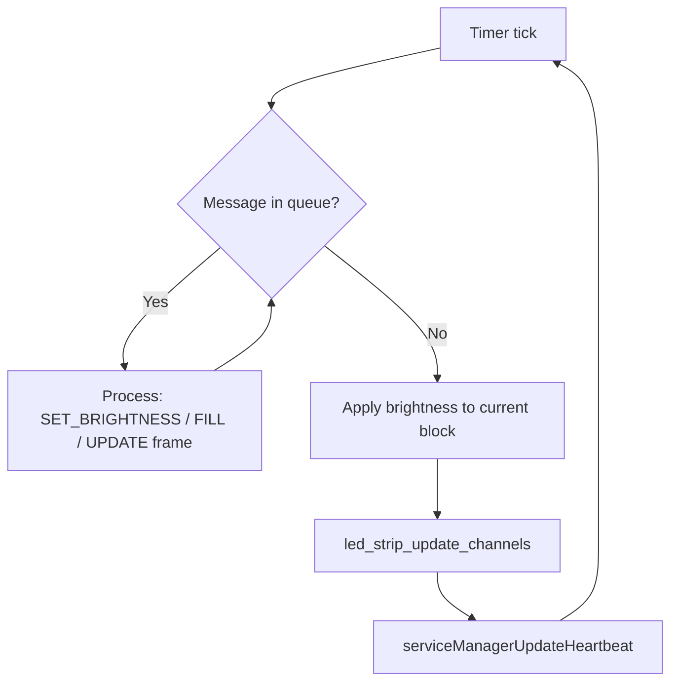
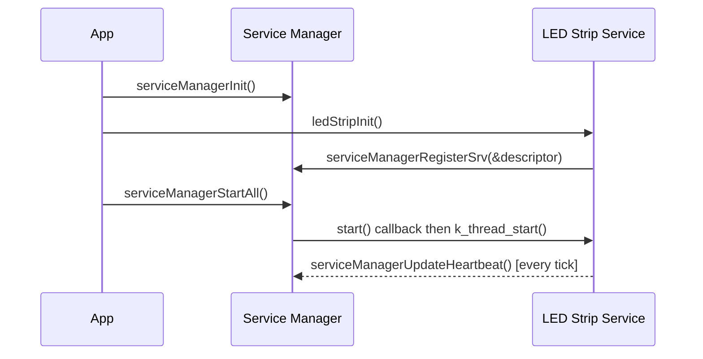

# LED Strip Service

## Overview

The LED Strip service is a transport-layer service responsible for writing pixel data to a
single LED strip at a constant refresh rate via the Zephyr LED strip driver API. It is
driver-agnostic — any strip supported by `led_strip_update_channels()` (WS2812, APA102, etc.)
is supported through DTS configuration.

The service owns no color logic. All color mapping, animation, and channel ordering are the
responsibility of the producer (e.g. an animation service). The LED strip service only applies
global brightness scaling and pushes the current frame to hardware on every timer tick.

## Features

- **Constant-rate refresh**: Drives the strip at a fixed rate set by Kconfig, independent of
  producer frame rate
- **Driver-agnostic**: Uses `led_strip_update_channels()` — works with any Zephyr LED strip driver
- **RGBW support**: Configurable 3 or 4 channels per pixel via Kconfig; channel order is
  DTS-defined and handled by the producer
- **Double-buffered**: Two-block CMSIS pool eliminates tearing between producer and renderer
- **Global brightness**: Applied at render time; does not modify the pool block
- **Service Manager integration**: Heartbeat, priority-ordered startup, stop/suspend lifecycle
- **Shell commands**: Runtime brightness control and fill via Zephyr shell

## Architecture

### Pixel Type

The service uses a generic pixel type with no color semantics. Channel order is determined by
the DTS `color-mapping` property of the LED strip device and is the producer's responsibility
to apply:

```c
#if CONFIG_ENYA_LED_STRIP_NUM_CHANNELS == 4
typedef union
{
  uint8_t ch[4];
  struct
  {
    uint8_t ch0;
    uint8_t ch1;
    uint8_t ch2;
    uint8_t ch3;
  };
} LedPixel_t;
#else
typedef union
{
  uint8_t ch[3];
  struct
  {
    uint8_t ch0;
    uint8_t ch1;
    uint8_t ch2;
  };
} LedPixel_t;
#endif
```

`ch[N]` provides indexed access for loops and direct casting to `uint8_t *` for
`led_strip_update_channels()`. Named fields (`ch0`, `ch1`, ...) provide explicit per-channel
access for producers. Referencing `ch3` in a 3-channel build is a compile-time error.

### Double Buffer

The service owns a CMSIS memory pool with exactly **2 blocks**, each of size
`DT_PROP(DT_ALIAS(led_strip), chain_length) * CONFIG_ENYA_LED_STRIP_NUM_CHANNELS` bytes.
The pixel count is read directly from the DTS `chain-length` property — no Kconfig symbol
is needed, eliminating any risk of mismatch between software and hardware configuration.

```
Pool (2 blocks of chain_length × NUM_CHANNELS bytes)
  Block A → held by LED strip service  (current frame, rendered every tick)
  Block B → held by producer           (being written)

On submit: service frees A, holds B → producer can allocate A again
```

The service holds a pointer to the current block and renders directly from it on every timer
tick — no copy is made. When a new frame arrives via the message queue, the old block is freed
and the new pointer is stored.

### Thread Model

The service runs a dedicated thread that:

1. Drains pending messages from its control queue (brightness updates, fill commands,
   new frame submissions)
2. Applies global brightness scaling to the current frame into a temporary render pass
3. Calls `led_strip_update_channels()` directly with the current pool block
4. Updates its heartbeat

Refresh timing is driven by `k_timer` at `CONFIG_ENYA_LED_STRIP_REFRESH_RATE_HZ`.



### Startup Sequence



### Channel Ordering

Channel order is **not** managed by this service. The producer must consult the DTS
`color-mapping` property of the LED strip device and fill `ch0`, `ch1`, `ch2` (and `ch3` for
RGBW) accordingly.

Example: for a GRB strip with DTS `color-mapping = <LED_COLOR_ID_GREEN LED_COLOR_ID_RED
LED_COLOR_ID_BLUE>`, the producer sets `ch0 = green`, `ch1 = red`, `ch2 = blue`.

The `color-mapping` array is readable at compile time via:

```c
static const uint8_t colorMapping[] = DT_PROP(LED_STRIP_NODE, color_mapping);
```

### Global Brightness

Brightness is a value from `0` (off) to `255` (full). It is applied at render time by scaling
each channel: `out = (ch * brightness) / 255`. The pool block is never modified — scaling is
done into the driver's own internal buffer during the `led_strip_update_channels()` call.

> **Note**: `led_strip_update_channels()` takes a `uint8_t *` flat array. Brightness scaling
> requires a temporary render buffer of `PIXEL_COUNT × NUM_CHANNELS` bytes inside the service.
> This is the only extra buffer beyond the two pool blocks.

## Configuration

### DTS

Bind the service to a LED strip device via alias in your board overlay:

```dts
/ {
    aliases {
        led-strip = &ws2812;
    };
};

&spi1 {
    ws2812: ws2812@0 {
        compatible = "worldsemi,ws2812-spi";
        reg = <0>;
        spi-max-frequency = <4000000>;
        chain-length = <144>;
        color-mapping = <LED_COLOR_ID_GREEN
                         LED_COLOR_ID_RED
                         LED_COLOR_ID_BLUE
                         LED_COLOR_ID_WHITE>;
        reset-delay = <280>;
    };
};
```

### Kconfig Options

Enable the service in `prj.conf`:

```kconfig
CONFIG_ENYA_LED_STRIP=y
CONFIG_ENYA_LED_STRIP_LOG_LEVEL=3
```

Tuning options:

```kconfig
# Channels per pixel — must match the DTS color-mapping length (3=RGB, 4=RGBW)
CONFIG_ENYA_LED_STRIP_NUM_CHANNELS=4

# Refresh rate in Hz
CONFIG_ENYA_LED_STRIP_REFRESH_RATE_HZ=60

# Message queue depth
CONFIG_ENYA_LED_STRIP_MSG_COUNT=4

# Thread settings
CONFIG_ENYA_LED_STRIP_STACK_SIZE=1024
CONFIG_ENYA_LED_STRIP_THREAD_PRIORITY=5

# Shell commands
CONFIG_ENYA_LED_STRIP_SHELL=y
```

| Symbol | Default | Description |
|--------|---------|-------------|
| `CONFIG_ENYA_LED_STRIP_NUM_CHANNELS` | 4 | Channels per pixel (3=RGB, 4=RGBW) — must match DTS `color-mapping` length |
| `CONFIG_ENYA_LED_STRIP_REFRESH_RATE_HZ` | 60 | Refresh rate (Hz) |
| `CONFIG_ENYA_LED_STRIP_MSG_COUNT` | 4 | Control message queue depth |
| `CONFIG_ENYA_LED_STRIP_STACK_SIZE` | 1024 | Thread stack size (bytes) |
| `CONFIG_ENYA_LED_STRIP_LOG_LEVEL` | 3 | 0=OFF 1=ERR 2=WRN 3=INF 4=DBG |
| `CONFIG_ENYA_LED_STRIP_THREAD_PRIORITY` | 5 | Preemptible thread priority |
| `CONFIG_ENYA_LED_STRIP_SHELL` | y | Enable shell commands |

### RAM Budget

For a 144-pixel GRB strip (3 channels):

| Buffer | Size |
|--------|------|
| Pool block A (current frame) | 432 B |
| Pool block B (producer frame) | 432 B |
| Render scratch buffer | 432 B |
| Driver SPI encode buffer (internal) | ~1728 B |
| **Total service-side** | **~3024 B** |

## API Usage

### Initialization

```c
#include "ledStrip.h"

int err = ledStripInit();
if (err < 0) {
  LOG_ERR("LED strip init failed: %d", err);
  return err;
}
```

### Submitting a Frame

The producer allocates a block from the service pool, fills it with channel data in DTS
wire order, then submits it:

```c
LedPixel_t *frame = ledStripAllocFrame();
if (frame == NULL) {
  LOG_WRN("no frame buffer available");
  return -ENOMEM;
}

for (size_t i = 0; i < DT_PROP(DT_ALIAS(led_strip), chain_length); i++) {
  frame[i].ch0 = green[i];   /* GRB strip example */
  frame[i].ch1 = red[i];
  frame[i].ch2 = blue[i];
  frame[i].ch3 = white[i];
}

ledStripSubmitFrame(frame);
```

The service frees the previous frame block on receipt. The producer must not modify the
frame after calling `ledStripSubmitFrame()`.

### Setting Brightness

```c
ledStripSetBrightness(128);   /* 50% brightness */
```

Non-blocking — enqueues a control message.

## Shell Commands

Shell commands are registered under `led_strip`. Enable with
`CONFIG_ENYA_LED_STRIP_SHELL=y`.

```console
# Set global brightness (0–255)
uart:~$ led_strip brightness 128

# Fill all pixels with channel values
uart:~$ led_strip fill <ch0> <ch1> <ch2>           # RGB
uart:~$ led_strip fill <ch0> <ch1> <ch2> <ch3>     # RGBW

# Turn off all pixels
uart:~$ led_strip off
```

## Implementing a Producer

A producer that drives the LED strip must:

1. **Read the DTS color mapping** at init time to know channel order:

   ```c
   static const uint8_t colorMapping[] = DT_PROP(DT_ALIAS(led_strip), color_mapping);
   ```

2. **Allocate a frame buffer** from the service pool, fill channels in wire order, and
   submit:

   ```c
   LedPixel_t *frame = ledStripAllocFrame();
   /* fill frame[i].ch0 .. ch[N-1] per colorMapping */
   ledStripSubmitFrame(frame);
   ```

3. **Do not free the frame** — `ledStripSubmitFrame()` transfers ownership to the service.

4. **Handle allocation failure** — if the pool has no free block (both held by service and
   a previous unprocessed submission), back off and retry on the next animation tick.

## Troubleshooting

### Strip Not Updating

**Symptom**: Strip shows no output or stays on the last frame.

**Solutions**:
- Verify the DTS alias `led-strip` is correctly bound to the strip device
- Check `CONFIG_ENYA_LED_STRIP_NUM_CHANNELS` matches the `color-mapping` length in DTS (3 for RGB, 4 for RGBW)
- Run `led_strip fill 0 255 0 0` from the shell to isolate whether the service is running

### Wrong Colors

**Symptom**: Colors are correct but in the wrong positions (e.g. red appears green).

**Cause**: Producer is not applying the DTS `color-mapping` correctly.

**Solution**: Read `DT_PROP(DT_ALIAS(led_strip), color_mapping)` and map channels accordingly.

### Frame Allocation Failure

**Symptom**: `ledStripAllocFrame()` returns `NULL`.

**Cause**: Both pool blocks are in use — one held by the service as the current frame,
one pending in the message queue (previous submission not yet consumed).

**Solution**: Reduce producer frame rate or increase `CONFIG_ENYA_LED_STRIP_MSG_COUNT`.
