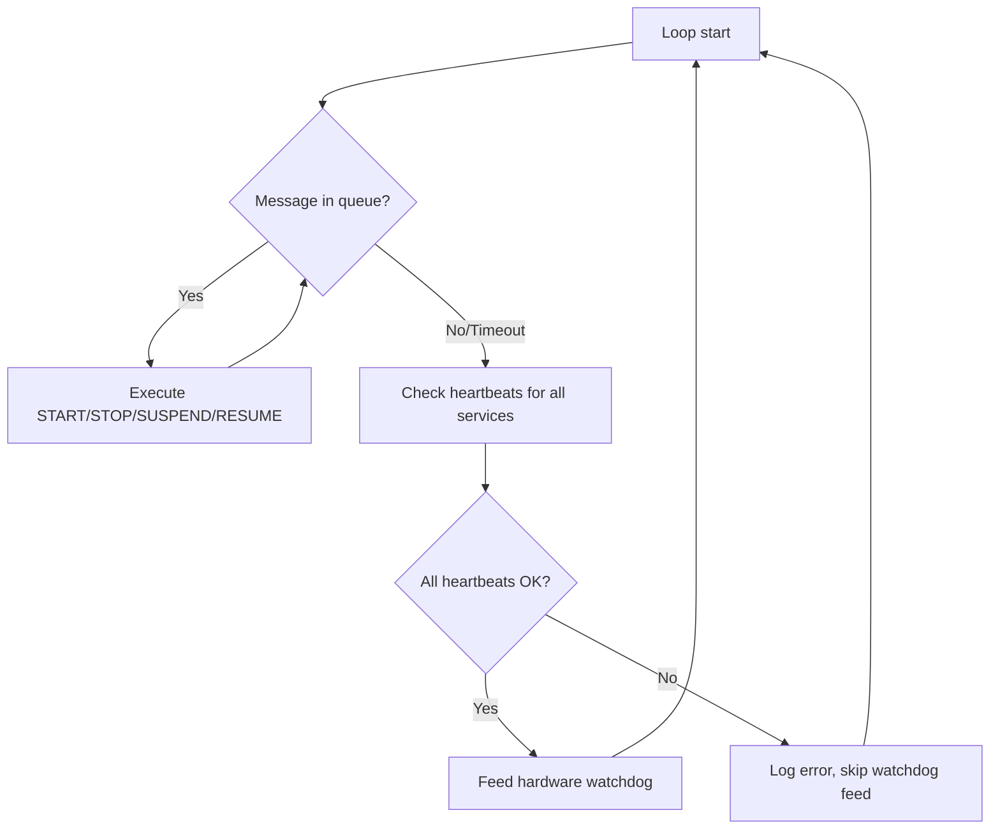
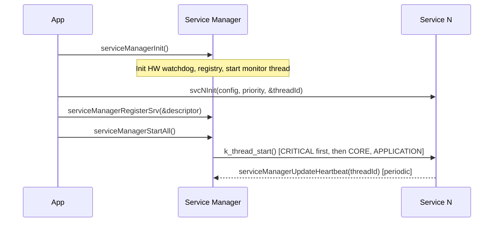

# Service Manager

## Overview

The Service Manager is the lifecycle supervisor for all Electronya embedded services. It
initializes and starts registered services in priority order, monitors their health via
a heartbeat mechanism, and gates hardware watchdog feeding on all services being alive.
State changes (start, stop, suspend, resume) are requested asynchronously through the
service manager's message queue.

## Features

- **Priority-ordered startup**: Services start in `CRITICAL → CORE → APPLICATION` order
- **Asynchronous lifecycle control**: Start, stop, suspend, and resume via message queue
- **Heartbeat monitoring**: Per-service configurable heartbeat interval with missed-beat tracking
- **Hardware watchdog integration**: Watchdog is only fed when all services have checked in
- **Thread-name-based logging**: Log messages identify services by thread name
- **Shell commands**: Runtime inspection and control via Zephyr shell

## Architecture

### Thread Model

The service manager runs a dedicated monitor thread that loops at
`CONFIG_SVC_MGR_LOOP_PERIOD_MS`. On each iteration it:

1. Drains pending lifecycle requests from its message queue
2. Checks the heartbeat of every registered service
3. Feeds the hardware watchdog — **only if** all services passed their heartbeat check



### Startup Sequence



### Heartbeat Protocol

Each registered service must periodically call `serviceManagerUpdateHeartbeat()` from its
own thread. If the interval (`heartbeatIntervalMs`) elapses without a heartbeat, the
service manager increments `missedHeartbeats` and stops feeding the hardware watchdog,
eventually triggering a system reset.

### State Confirmation Protocol

Services that handle STOP or SUSPEND must call `serviceManagerConfirmState()` before
actually stopping or suspending. This updates the registry so the monitor thread has
accurate state:

- **STOP**: call `serviceManagerConfirmState(threadId, SVC_STATE_STOPPED)` then exit the
  thread loop
- **SUSPEND**: call `serviceManagerConfirmState(threadId, SVC_STATE_SUSPENDED)` then call
  `k_thread_suspend(k_current_get())`

START and RESUME are handled directly by the service manager via `k_thread_start()` /
`k_thread_resume()` — the service thread cannot read its control queue when it has not
started or is suspended.

## Configuration

### Kconfig Options

Enable the service manager in `prj.conf`:

```kconfig
CONFIG_ENYA_SERVICE_MANAGER=y
CONFIG_ENYA_SERVICE_MANAGER_LOG_LEVEL=3
CONFIG_ENYA_SERVICE_MANAGER_STACK_SIZE=2048
CONFIG_ENYA_SERVICE_MANAGER_THREAD_PRIORITY=1
```

Tuning options:

```kconfig
# Maximum services that can be registered (also sets the message queue depth)
CONFIG_SVC_MGR_MAX_SERVICES=16

# Hardware watchdog timeout (ms) — must be >> LOOP_PERIOD_MS
CONFIG_SVC_MGR_WDT_TIMEOUT_MS=5000

# How often the monitor thread runs
CONFIG_SVC_MGR_LOOP_PERIOD_MS=100

# Shell commands
CONFIG_ENYA_SERVICE_MANAGER_SHELL=y
```

The `WATCHDOG` Kconfig symbol is automatically selected.

| Symbol | Default | Description |
|--------|---------|-------------|
| `CONFIG_ENYA_SERVICE_MANAGER_STACK_SIZE` | 2048 | Monitor thread stack (bytes) |
| `CONFIG_ENYA_SERVICE_MANAGER_LOG_LEVEL` | 3 | 0=OFF 1=ERR 2=WRN 3=INF 4=DBG |
| `CONFIG_SVC_MGR_MAX_SERVICES` | 16 | Max registered services (1–64) |
| `CONFIG_SVC_MGR_WDT_TIMEOUT_MS` | 5000 | Hardware watchdog timeout (ms) |
| `CONFIG_SVC_MGR_LOOP_PERIOD_MS` | 100 | Monitor loop period (ms) |
| `CONFIG_ENYA_SERVICE_MANAGER_THREAD_PRIORITY` | 1 | Preemptible thread priority |
| `CONFIG_ENYA_SERVICE_MANAGER_SHELL` | y | Enable shell commands |

## API Usage

### Initialization

```c
#include "serviceManager.h"

int err = serviceManagerInit();
if (err < 0) {
  LOG_ERR("Service manager init failed: %d", err);
  return err;
}
```

Call `serviceManagerInit()` **before** registering any services. It initializes the
hardware watchdog, the service registry, and starts the monitor thread.

### Registering a Service

```c
k_tid_t myServiceThreadId; /* obtained from your service's init function */

ServiceDescriptor_t descriptor = {
  .threadId           = myServiceThreadId,
  .priority           = SVC_PRIORITY_CORE,
  .heartbeatIntervalMs = 1000,       /* service must heartbeat at least every 1 s */
  .start              = myServiceOnStart,   /* called just before k_thread_start() */
  .stop               = myServiceOnStop,    /* called to signal stop */
  .suspend            = myServiceOnSuspend, /* called to signal suspend */
  .resume             = myServiceOnResume,  /* called just before k_thread_resume() */
};

err = serviceManagerRegisterSrv(&descriptor);
if (err < 0) {
  LOG_ERR("Register failed: %d", err);
  return err;
}
```

Register all services **after** `serviceManagerInit()` and **before**
`serviceManagerStartAll()`.

### Starting All Services

```c
err = serviceManagerStartAll();
if (err < 0) {
  LOG_ERR("Start all failed: %d", err);
  return err;
}
```

Iterates through priority levels (`CRITICAL → CORE → APPLICATION`) and starts each
registered service in order.

### Runtime Lifecycle Control

```c
/* Request a service to stop (asynchronous) */
serviceManagerRequestStop(myServiceThreadId);

/* Request a service to suspend (asynchronous) */
serviceManagerRequestSuspend(myServiceThreadId);

/* Request a service to resume */
serviceManagerRequestResume(myServiceThreadId);

/* Request a stopped service to start again */
serviceManagerRequestStart(myServiceThreadId);
```

All requests are non-blocking — they enqueue a message and return immediately.

### Implementing a Managed Service

A service managed by the service manager must:

1. **Heartbeat** periodically:
   ```c
   /* Inside the service thread loop */
   serviceManagerUpdateHeartbeat(k_current_get());
   ```

2. **Confirm state** before stopping or suspending:
   ```c
   /* Handling a STOP request */
   serviceManagerConfirmState(k_current_get(), SVC_STATE_STOPPED);
   return; /* exit thread loop */

   /* Handling a SUSPEND request */
   serviceManagerConfirmState(k_current_get(), SVC_STATE_SUSPENDED);
   k_thread_suspend(k_current_get());
   /* execution resumes here after serviceManagerRequestResume() */
   ```

3. **Provide lifecycle callbacks** in its descriptor for any state it handles.

### Complete Service Integration Example

```c
#include <zephyr/kernel.h>
#include "serviceManager.h"
#include "myService.h"

K_THREAD_STACK_DEFINE(myServiceStack, 1024);
static struct k_thread myServiceThread;
static k_tid_t myServiceThreadId;

static volatile bool shouldStop = false;
static volatile bool shouldSuspend = false;

static int onStop(void)
{
  shouldStop = true;
  return 0;
}

static int onSuspend(void)
{
  shouldSuspend = true;
  return 0;
}

static void myServiceRun(void *p1, void *p2, void *p3)
{
  ARG_UNUSED(p1); ARG_UNUSED(p2); ARG_UNUSED(p3);

  for (;;) {
    if (shouldStop) {
      shouldStop = false;
      serviceManagerConfirmState(k_current_get(), SVC_STATE_STOPPED);
      return;
    }
    if (shouldSuspend) {
      shouldSuspend = false;
      serviceManagerConfirmState(k_current_get(), SVC_STATE_SUSPENDED);
      k_thread_suspend(k_current_get());
      /* resumed by service manager */
    }

    /* Do work */
    doWork();

    /* Heartbeat */
    serviceManagerUpdateHeartbeat(k_current_get());

    k_sleep(K_MSEC(100));
  }
}

int myServiceInit(k_tid_t *threadId)
{
  *threadId = k_thread_create(&myServiceThread, myServiceStack, 1024,
                               myServiceRun, NULL, NULL, NULL,
                               K_PRIO_PREEMPT(5), 0, K_FOREVER);
  k_thread_name_set(*threadId, "myService");
  myServiceThreadId = *threadId;
  return 0;
}

/* In application main */
void main(void)
{
  k_tid_t threadId;

  serviceManagerInit();

  myServiceInit(&threadId);

  ServiceDescriptor_t desc = {
    .threadId            = threadId,
    .priority            = SVC_PRIORITY_CORE,
    .heartbeatIntervalMs = 500,
    .stop                = onStop,
    .suspend             = onSuspend,
  };
  serviceManagerRegisterSrv(&desc);

  serviceManagerStartAll();
}
```

## Shell Commands

```bash
# List all registered services with status
uart:~$ srv_mgr ls
Index Name                 Priority     State      Heartbeat(ms)   Missed
0     adcAcquisition       core         running    1000            0
1     datastore            core         running    1000            0
2     myService            application  running    500             0

# Start a stopped service by index
uart:~$ srv_mgr start 2
SUCCESS: service 2 started

# Stop a running service by index
uart:~$ srv_mgr stop 2
SUCCESS: service 2 stopped

# Suspend a running service
uart:~$ srv_mgr suspend 1
SUCCESS: service 1 suspended

# Resume a suspended service
uart:~$ srv_mgr resume 1
SUCCESS: service 1 resumed
```

## Troubleshooting

### Hardware Watchdog Resets

**Symptom**: System resets unexpectedly.

**Cause**: One or more services stopped heartbeating, causing the watchdog to starve.

**Solutions**:
- Run `srv_mgr ls` and check the `Missed` column for the offending service
- Ensure the service calls `serviceManagerUpdateHeartbeat()` more frequently than
  `heartbeatIntervalMs`
- Increase `heartbeatIntervalMs` in the descriptor if the service loop is legitimately slow
- Increase `CONFIG_SVC_MGR_WDT_TIMEOUT_MS` as a temporary measure while debugging

### Service Stuck in STOPPING/SUSPENDING

**Symptom**: Service does not reach STOPPED or SUSPENDED state after a request.

**Cause**: Service is not calling `serviceManagerConfirmState()` before stopping/suspending.

**Solutions**:
- Verify the stop/suspend callbacks set a flag that the service thread checks
- Verify the thread loop actually reaches the `serviceManagerConfirmState()` call
- Check for blocking calls in the service that prevent the thread from running

### Registry Full

**Symptom**: `serviceManagerRegisterSrv()` returns an error.

**Solution**: Increase `CONFIG_SVC_MGR_MAX_SERVICES`.

### Message Queue Full

**Symptom**: `serviceManagerRequest*()` returns `-ENOMSG` or similar.

**Cause**: More lifecycle requests were enqueued than the queue depth allows
(`CONFIG_SVC_MGR_MAX_SERVICES` sets the queue depth).

**Solutions**:
- Increase `CONFIG_SVC_MGR_MAX_SERVICES`
- Reduce the rate of lifecycle requests
