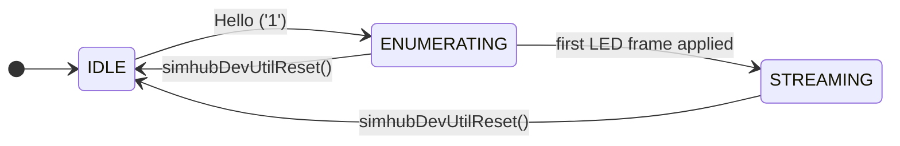
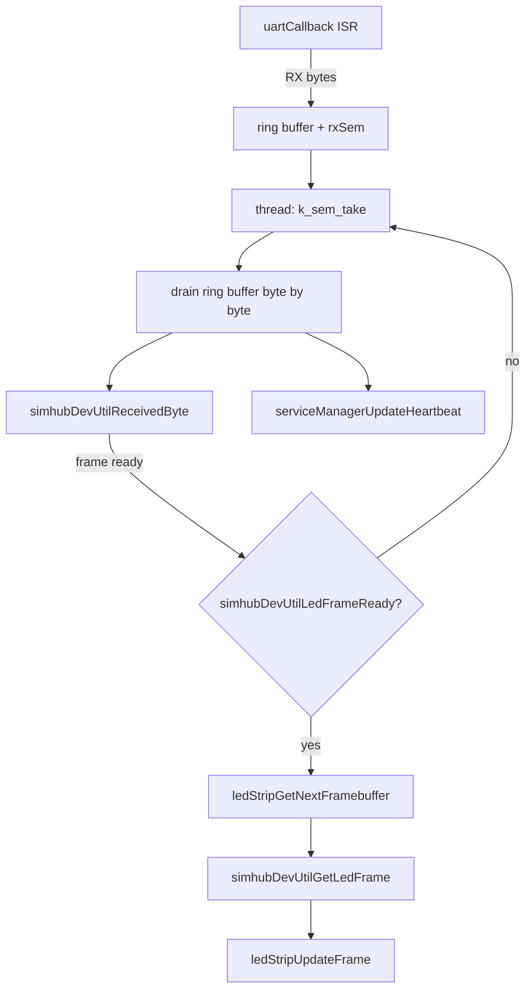
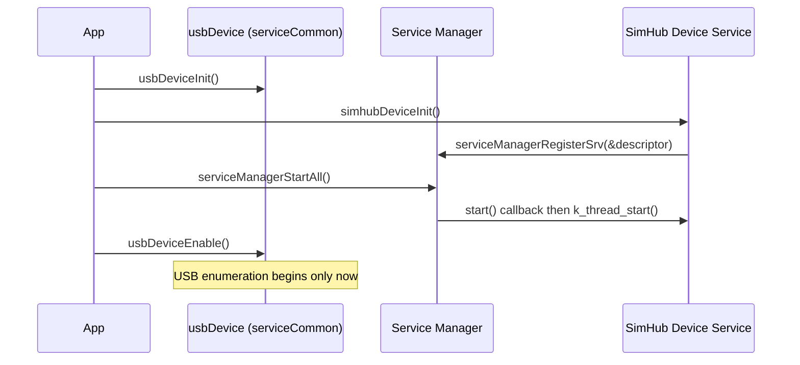

# SimHub Device Service

## Overview

The SimHub Device service emulates a SimHub Standard Firmware Arduino/Dash LED device over USB
CDC ACM. It is a **producer** for the LED Strip service — it receives RGB frame data from
SimHub (PC sim-racing dashboard software) and submits it via `ledStripGetNextFramebuffer()` /
`ledStripUpdateFrame()`.

The service owns no rendering logic. Frame data arrives verbatim from SimHub and is forwarded
directly to the LED strip service. Global brightness, refresh rate, and hardware push are all
handled by the LED strip service.

USB device stack initialization is **not** owned by this service. It is handled by the shared
`usbDevice` utility in `serviceCommon`. The application calls `usbDeviceInit()` before
`simhubDeviceInit()`, and `usbDeviceEnable()` after all services (including this one) are
registered with the service manager.

> **Note**: The protocol below is not a published SimHub spec — it was reverse-engineered from
> Wireshark captures of real SimHub ↔ Arduino traffic. It uses a binary ARQ (acknowledge/retry)
> frame format, not the simpler ASCII `proto`/`ledsc`/`sleds` protocol described in some SimHub
> community documentation. If SimHub's wire behavior changes, re-capture and update this doc.

## Protocol

### ARQ Frame Format

All frames sent by SimHub share the same wire layout:

```
01 01 ID LEN DATA[0..LEN-1] CRC8
```

| Field | Size | Description |
|-------|------|-------------|
| `01 01` | 2 bytes | Sync header (fixed) |
| `ID` | 1 byte | Packet ID; `0xFF` = broadcast (Hello only) |
| `LEN` | 1 byte | Payload length in bytes (0–32) |
| `DATA` | `LEN` bytes | Payload; `DATA[0]` is always `0x03` (MESSAGE_HEADER), `DATA[1]` is the command byte |
| `CRC8` | 1 byte | CRC-8 (poly `0xD5`, init `0`, no reflection) over `ID \|\| LEN \|\| DATA` |

### Device Responses

Responses are written directly to the UART TX path — they do **not** use the ARQ frame wrapper:

| Type byte | Meaning | Wire format |
|-----------|---------|-------------|
| `0x03` | ACK | `03 ID` |
| `0x04` | NACK | `04 lastId reason` (builder present, currently unused by any handler) |
| `0x06` | String | `06 LEN str[0..LEN-1] 20` |
| `0x08` | Single byte | `08 val` |

Multiple response tokens may be packed back-to-back in a single UART write.

### Enumeration Sequence

SimHub probes the device with sequentially numbered packets. The broadcast Hello (`ID=FF`)
does not advance the sequence counter.

| Phase | `DATA[1]` cmd | Device response |
|-------|---------------|------------------|
| Hello | `'1'` | `ACK(0xFF)` + `BYTE(0x6A)` → session enters `ENUMERATING` |
| Features | `'0'` | `ACK` + `STR('G')` + `STR('N')` + `STR('I')` + `STR('J')` + `STR('P')` + `STR('X')` + `STR_TERM` |
| LED count | `'4'` | `ACK` + `BYTE(SIMHUB_LED_COUNT)` |
| TM1638 count | `'2'` | `ACK` + `BYTE(0)` |
| Simple modules | `'B'` | `ACK` + `BYTE(0)` |
| Device name | `'N'` | `ACK` + `STR(CONFIG_ENYA_SIMHUB_DEVICE_NAME)` + `STR_TERM` |
| Unique ID | `'I'` | `ACK` + `STR(CONFIG_ENYA_SIMHUB_DEVICE_UID)` + `STR_TERM` |
| Button count | `'J'` | `ACK` + `BYTE(CONFIG_ENYA_SIMHUB_DEVICE_BUTTON_COUNT)` |
| X sub-commands | `0x03` (triple-H prefix) or `'X'` | routed to the X sub-command table below |
| Baud rate | `'8'` | `ACK` only (CDC ACM baud rate is virtual) |

X sub-commands match on the sub-command string after the ACK:

| Sub-command | Response appended after ACK |
|-------------|------------------------------|
| `"list"` | `STR("keepalive\n")` + `STR("mcutype\n")` + `BYTE(0x0A)` |
| `"mcutype"` | `BYTE(0x1E)` + `BYTE(0x95)` + `BYTE(0x87)` |
| anything else | ACK only |

### LED Streaming — Single Frame (`'6'`)

`DATA[1] = '6'`, `DATA[2] = 0x01` (mode), `DATA[3..]` = RGB triplets for every LED. Applied only
if the payload is long enough for `SIMHUB_LED_COUNT` triplets; always ACKed regardless.

### LED Streaming — Group Frames (`'G'`)

This is the path SimHub actually uses in practice (confirmed at ~2 Hz over live captures). A
group update can span one or more ARQ frames:

- **Header frame** (`LEN ≥ 8`): `DATA[6]` = first LED index, `DATA[7]` = LED count for this
  update, `DATA[8..]` = leading RGB bytes. If `LEN == 16` the group stays open (more data
  frames follow); response is `ACK` only. Any other length closes the group immediately.
- **Continuation frames** (while a group is open): `LEN == 16` appends 16 more raw bytes and
  keeps the group open (`ACK` only); any other length appends the remaining bytes minus a
  trailing button-state byte, closes the group, and responds `ACK` + `BYTE(0x15)` — SimHub reads
  `0x15` as "frame applied, ready for the next sequence".
- The accumulated RGB bytes are written into the pending LED frame only for indices within
  `SIMHUB_LED_COUNT` — updates that would run past the strip length are clamped, not dropped
  entirely.
- The trailing byte of every closing frame is a button-state bitmask (bit 0 = button 0),
  retrievable via `simhubDevUtilGetButtonState()`.

### Session States



## Architecture

### ARQ Transport Layer (`simhubArqProto`)

Pure byte-level parser/builder — no session state, no Kconfig access:

- `simhubArqParseByte()` drives a `SYNC0 → SYNC1 → PKTID → LEN → DATA → CRC → DONE` state
  machine. A CRC mismatch resets straight back to `SYNC0`.
- `simhubArqBuildAck/Byte/Str/StrTerm()` build response tokens into a caller-supplied buffer.

### Session State Machine (`simhubDevUtil`)

Owns protocol session state and dispatches complete frames by command byte to one handler per
command (Hello, Features, LED count, …, group frame, group data, LED data). Tracks:

- `sessionState` — the state machine above
- `pendingLedFrame` / `ledFrameReady` — the next frame to hand to the LED strip service
- `groupActive`, `ledRxBuf`, `ledRxStart`, `ledRxCount` — in-progress `'G'` group accumulation
- `lastButtonState`

`simhubDevUtilLedFrameReady()` lets the caller check whether a frame is pending **without**
consuming it — this matters for the thread loop below.

### Thread Model



A single thread reads the CDC ACM UART via the **interrupt-driven UART API**
(`uart_irq_callback_user_data_set` / `uart_fifo_read` / `uart_fifo_fill`), buffering RX bytes in
a ring buffer and TX bytes through a small scratch buffer guarded by a semaphore.

> **Important**: The LED strip framebuffer pool has only 2 blocks. The thread loop only calls
> `ledStripGetNextFramebuffer()` when `simhubDevUtilLedFrameReady()` is true. Fetching a
> framebuffer on *every* completed ARQ frame — including the ~10 ACK-only exchanges in the
> enumeration handshake — would leak both pool blocks before the first real LED frame ever
> arrives, permanently starving the LED strip. This was a real bug found in production use.

### USB Transport

The CDC ACM UART is a Zephyr `zephyr,cdc-acm-uart` device instantiated entirely from
devicetree + Kconfig (`CONFIG_USBD_CDC_ACM_CLASS`). `simhubDeviceInit()` does not register any
USB class itself — it only looks up the device via `DEVICE_DT_GET(DT_ALIAS(simhub_uart))`. Class
registration happens once, generically, inside the shared `usbDeviceInit()` utility
(`usbd_register_all_classes()`), which is why service init order matters:



## Configuration

### DTS

Bind the service to a CDC ACM UART node and the LED strip via aliases in your board overlay:

```dts
&zephyr_udc0 {
    cdc_acm_uart0: cdc_acm_uart0 {
        compatible = "zephyr,cdc-acm-uart";
    };
};

/ {
    aliases {
        simhub-uart = &cdc_acm_uart0;
        led-strip = &ws2812;
    };
};
```

### Kconfig Options

Enable the service and its USB dependency in `prj.conf`:

```kconfig
CONFIG_USB_DEVICE_STACK_NEXT=y
CONFIG_USBD_CDC_ACM_CLASS=y
CONFIG_UDC_BUF_POOL_SIZE=4096
CONFIG_UART_ASYNC_API=y
CONFIG_UART_LINE_CTRL=y

CONFIG_ENYA_USB_DEVICE=y
CONFIG_ENYA_USB_DEVICE_VID=0x2341
CONFIG_ENYA_USB_DEVICE_PID=0x8036

CONFIG_ENYA_SIMHUB_DEVICE=y
```

> **Gotcha**: `CONFIG_UDC_BUF_POOL_SIZE` must be large enough for the largest single USB control
> transfer the host requests during enumeration (observed up to ~2 KB). Too small (e.g. the
> Zephyr default of 512) causes "Failed to allocate net_buf" / "Malformed setup packet" errors
> and the device never fully enumerates — 4096 has proven reliable.

Tuning options:

```kconfig
CONFIG_ENYA_SIMHUB_DEVICE_LOG_LEVEL=3
CONFIG_ENYA_SIMHUB_DEVICE_STACK_SIZE=1024
CONFIG_ENYA_SIMHUB_DEVICE_THREAD_PRIORITY=6
CONFIG_ENYA_SIMHUB_DEVICE_SERVICE_PRIORITY=2
CONFIG_ENYA_SIMHUB_DEVICE_HEARTBEAT_INTERVAL_MS=1000
CONFIG_ENYA_SIMHUB_DEVICE_NAME="Electronya LED"
CONFIG_ENYA_SIMHUB_DEVICE_UID="ENYA001"
CONFIG_ENYA_SIMHUB_DEVICE_BUTTON_COUNT=0
```

| Symbol | Default | Description |
|--------|---------|-------------|
| `CONFIG_ENYA_SIMHUB_DEVICE_LOG_LEVEL` | 3 | 0=OFF 1=ERR 2=WRN 3=INF 4=DBG |
| `CONFIG_ENYA_SIMHUB_DEVICE_STACK_SIZE` | 1024 | Thread stack size (bytes) |
| `CONFIG_ENYA_SIMHUB_DEVICE_THREAD_PRIORITY` | 6 | Preemptible thread priority |
| `CONFIG_ENYA_SIMHUB_DEVICE_SERVICE_PRIORITY` | 2 | Service Manager priority (0=CRITICAL, 1=CORE, 2=APPLICATION) |
| `CONFIG_ENYA_SIMHUB_DEVICE_HEARTBEAT_INTERVAL_MS` | 1000 | Heartbeat interval (ms) |
| `CONFIG_ENYA_SIMHUB_DEVICE_NAME` | `"Electronya LED"` | Device name reported during enumeration (`'N'`) |
| `CONFIG_ENYA_SIMHUB_DEVICE_UID` | `"ENYA001"` | Unique ID reported during enumeration (`'I'`) |
| `CONFIG_ENYA_SIMHUB_DEVICE_BUTTON_COUNT` | 0 | Button count reported during enumeration (`'J'`) |
| `CONFIG_ENYA_SIMHUB_DEVICE_SHELL` | y | Reserved — no shell commands implemented yet (see below) |

### Dependencies

```
CONFIG_ENYA_USB_DEVICE      (serviceCommon — USB stack owner)
    └── CONFIG_ENYA_SIMHUB_DEVICE
            └── CONFIG_ENYA_LED_STRIP
```

## API Usage

### Initialization

```c
#include "simhubDevice.h"
#include "usbDevice.h"

int err = usbDeviceInit(NULL);
if (err < 0) {
  LOG_ERR("USB device init failed: %d", err);
  return err;
}

err = simhubDeviceInit();
if (err < 0) {
  LOG_ERR("SimHub device init failed: %d", err);
  return err;
}

/* ... register/init remaining services ... */

err = serviceManagerStartAll();
if (err < 0)
  return err;

/* Enable USB only after every USB-capable service is registered. */
err = usbDeviceEnable();
```

## Shell Commands

**Not implemented yet.** `src/simhubDevice/simhubDevCmd.c` and `CONFIG_ENYA_SIMHUB_DEVICE_SHELL`
are reserved for future `simhub status` / `simhub reset` / `simhub info` commands, but the file
is currently empty.

## Testing

Tests live in `tests/simhubDevice/` and follow the same include-the-source pattern used
elsewhere in this project. All three suites run at 100% line/branch/function coverage.

- **`proto/`** — `simhubArqProto.c` in isolation: CRC-8, frame parser state machine (sync
  detection, length validation, CRC mismatch handling), and every response builder.
- **`util/`** — `simhubDevUtil.c` with the parser mocked: every command handler, the `'G'` group
  streaming state machine (short/long headers, continuation, terminal frames, out-of-bounds
  clamping), session state transitions, and the public getter API.
- **`service/`** — `simhubDevice.c` with UART/ring-buffer/service-manager mocked: the UART ISR,
  the thread's control-message handling (stop/suspend/resume), the RX drain loop (including the
  framebuffer-starvation guard described above), and `simhubDeviceInit()`'s error paths.

## Troubleshooting

### SimHub Not Recognizing the Device

**Symptom**: SimHub does not enumerate the device, or enumeration silently retries.

**Solutions**:
- Check `CONFIG_UDC_BUF_POOL_SIZE` — too small causes USB control-transfer allocation failures
  during enumeration (see the Kconfig gotcha above)
- Verify `CONFIG_ENYA_USB_DEVICE_VID` / `_PID` match what SimHub expects for an Arduino-class
  device
- Confirm the DTS alias `simhub-uart` is bound to a `zephyr,cdc-acm-uart` node
- Confirm `usbDeviceEnable()` is called **after** `simhubDeviceInit()` and
  `serviceManagerStartAll()`, not before

### LEDs Not Updating Despite Successful Enumeration

**Symptom**: SimHub connects and the "Test" button appears to send data, but the strip never
lights up.

**Cause**: Historically, this was a framebuffer pool leak — the RX loop allocated a strip
framebuffer on every completed ARQ frame instead of only when an LED update was actually ready,
exhausting the 2-block pool during the ACK-only enumeration handshake before any real LED frame
ever arrived. This is now guarded by `simhubDevUtilLedFrameReady()` (see Architecture above); if
you see this symptom again, check that guard hasn't regressed.
